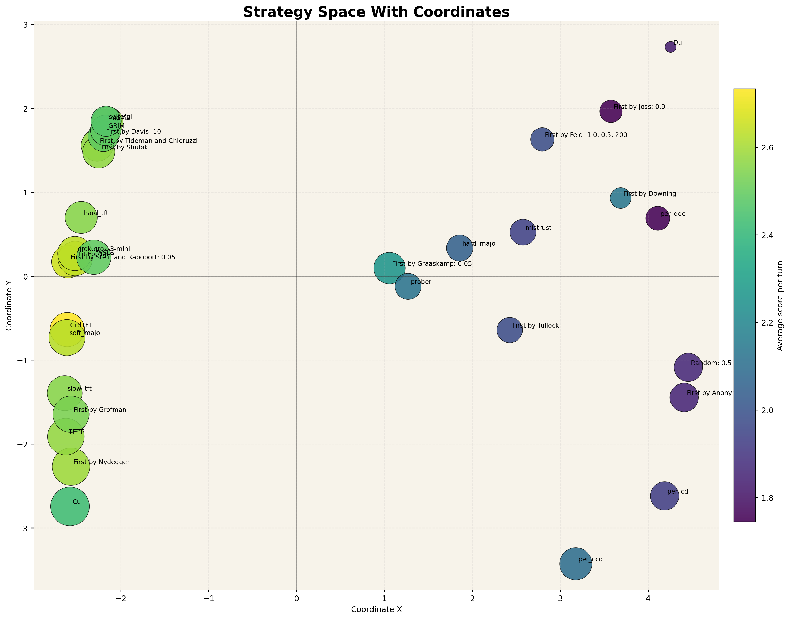

# Prisoner's Dilemma Tournament Lab

Iterated prisoner's dilemma strategies, a reproducible Axelrod-style tournament runner, and a visualization pipeline for exploring how cooperative and exploitative policies cluster against one another.



The plot above is a 2D strategy-space projection built from pairwise match payoffs. Nearby points behave similarly against the field; point size tracks cooperation rate, and color tracks score. It gives a fast visual read on which policies are cooperative, exploitable, retaliatory, or broadly robust.

## Structure

- `strategies.py`: strategy definitions and named strategy registry
- `main.py`: tournament runner and CLI
- `tournament_analysis.py`: full-field analysis, raw exports, and graph generation
- `analysis_output/`: generated standings, pairwise matrices, coordinates, and figures

## Strategy Families

- `all_c`, `all_d`: unconditional baselines that always cooperate or always defect
- `tit_for_tat`, `mistrust`, `hard_tft`, `slow_tft`, `tf2t`: reciprocity strategies that respond directly to recent opponent actions with different levels of forgiveness
- `spiteful`, `grim`: trigger strategies that cooperate until a defection, then switch to permanent punishment
- `soft_majo`, `hard_majo`: majority strategies that compare the opponent's total cooperations and defections so far
- `per_cd`, `per_ccd`, `per_ddc`: periodic strategies with fixed repeating patterns
- `pavlov`: win-stay, lose-shift; it repeats successful behavior and flips after disagreement
- `gradual`: escalates punishment length after repeated defections, then cools down with cooperative rounds
- `prober`: tests whether an opponent is exploitable with an opening probe sequence
- `mem2`: a small memory-two controller that switches among local policies based on the last two rounds
- `grok`: an xAI-backed strategy that asks Grok to choose a policy from a fixed menu, then plays that policy locally
- Axelrod first-tournament entrants: reconstructed versions of the classic submissions such as Tideman and Chieruzzi, Nydegger, Grofman, Shubik, Stein and Rapoport, Davis, Graaskamp, Downing, Feld, Joss, Tullock, Anonymous, and `Random`

## Quick Runs

Run the reconstructed first Axelrod tournament:

```powershell
python .\main.py --experiment axelrod-first --rounds 200 --repetitions 5 --seed 0 --format table
```

Run a custom tournament:

```powershell
python .\main.py --experiment custom --strategies "all_c,all_d,tit_for_tat,grim,pavlov,prober,mem2,grok" --rounds 200 --repetitions 1
```

Generate the full visual analysis:

```powershell
python .\tournament_analysis.py
```

## Outputs

The analysis script writes:

- `standings.csv`: ranked tournament summary
- `matches.csv`: per-match scores and cooperation rates
- `pairwise_matrix.csv`: average score matrix across the field
- `space_coordinates.csv`: 2D coordinates used for the space plot
- `ranking_skyline.png`, `pairwise_heatmap.png`, `strategy_space.png`, `cooperation_bubble.png`, `polar_constellation.png`

## Notes

- Default payoffs are `T=5, R=3, P=1, S=0`.
- The first-tournament preset follows published descriptions and modern documented reconstructions where the original submissions were underspecified.
- The Grok-backed strategy reads `XAI_API_KEY` from the environment or from `.secret`.
