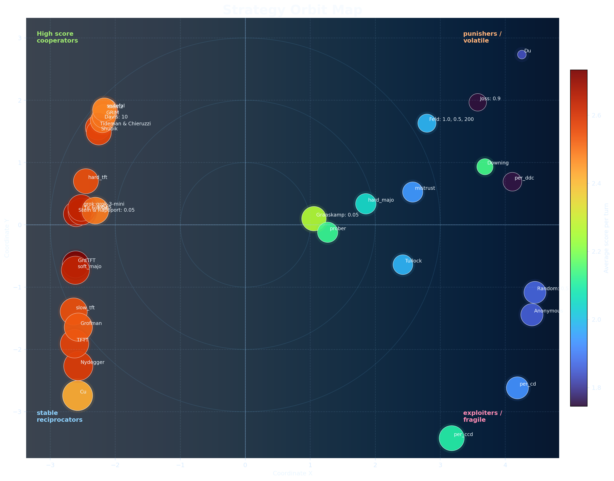

# Prisoner's Dilemma Lab

Cleaned research repo for iterated prisoner's dilemma experiments, strategy design, tournament benchmarking, and visual analysis.



The orbit map above is a 2D projection built from pairwise tournament outcomes. Nearby strategies behave similarly against the field; point size reflects cooperation and color reflects average score. It is the fastest way to see which strategies are stable reciprocators, opportunistic exploiters, or durable tournament winners.

## Layout

```text
.
├─ ipdlab/              core package
│  ├─ __init__.py
│  ├─ cli.py
│  └─ strategies.py
├─ scripts/             analysis and profiling entrypoints
│  ├─ tournament_analysis.py
│  ├─ innovation_lab.py
│  ├─ profile_strategy.py
│  └─ eleanor_analysis.py
├─ docs/                strategy notes and background writeups
│  ├─ ELEANOR.md
│  ├─ INNOVATION.md
│  ├─ rationale.md
│  └─ strategies.md
├─ outputs/analysis/    generated CSVs, JSON summaries, and plots
├─ archive/             legacy one-file prototype
│  └─ pd_experiment.py
├─ README.md
└─ .gitignore
```

## Main Pieces

- [`ipdlab/strategies.py`](D:\prisoner's dilemma\ipdlab\strategies.py): all strategy implementations and the named registry
- [`ipdlab/cli.py`](D:\prisoner's dilemma\ipdlab\cli.py): tournament CLI for quick runs
- [`scripts/tournament_analysis.py`](D:\prisoner's dilemma\scripts\tournament_analysis.py): full-field analysis, rankings, space coordinates, and plots
- [`scripts/innovation_lab.py`](D:\prisoner's dilemma\scripts\innovation_lab.py): search and benchmarking for new strategy experiments
- [`scripts/profile_strategy.py`](D:\prisoner's dilemma\scripts\profile_strategy.py): focused validation and plots for any one strategy

## Strategy Groups

- Baselines: `all_c`, `all_d`, `random`
- Reciprocal families: `tit_for_tat`, `mistrust`, `tf2t`, `hard_tft`, `slow_tft`, `pavlov`
- Trigger families: `spiteful`, `grim`
- Counting families: `soft_majo`, `hard_majo`
- Periodic families: `per_cd`, `per_ccd`, `per_ddc`
- Adaptive controllers: `gradual`, `mem2`, `prober`
- Grok-backed players: `grok`, `mara`
- Custom project strategies: `eleanor`, `nadia`
- Reconstructed Axelrod entrants: Tideman & Chieruzzi, Nydegger, Grofman, Shubik, Stein & Rapoport, Davis, Graaskamp, Downing, Feld, Joss, Tullock, Anonymous, `Random`

## Quick Commands

Run the classic Axelrod-first style tournament:

```powershell
python -m ipdlab.cli --experiment axelrod-first --rounds 200 --repetitions 5 --seed 0 --format table
```

Run a custom tournament:

```powershell
python -m ipdlab.cli --experiment custom --strategies "eleanor,nadia,mara,tit_for_tat,grim,soft_majo" --rounds 200 --repetitions 1
```

Generate the full visual field analysis:

```powershell
python .\scripts\tournament_analysis.py
```

Run the strategy innovation search:

```powershell
python .\scripts\innovation_lab.py
```

Profile one strategy in detail:

```powershell
python .\scripts\profile_strategy.py --strategy eleanor --rounds 200 --repetitions 20 --seed-count 10
```

## Current Headlines

- `Eleanor` is still the strongest validated tournament winner in the current field
- `Mara` is the strongest pure Grok-based player currently implemented
- `Nadia` is the strongest fully local custom controller from the latest search round

Detailed writeups:

- [`docs/ELEANOR.md`](D:\prisoner's dilemma\docs\ELEANOR.md)
- [`docs/INNOVATION.md`](D:\prisoner's dilemma\docs\INNOVATION.md)
- [`docs/rationale.md`](D:\prisoner's dilemma\docs\rationale.md)

## Notes

- Default payoffs are `T=5, R=3, P=1, S=0`.
- Generated artifacts are stored in [`outputs/analysis`](D:\prisoner's dilemma\outputs\analysis).
- `.secret` stays local and is used only for xAI-backed strategies.
- [`archive/pd_experiment.py`](D:\prisoner's dilemma\archive\pd_experiment.py) is preserved as legacy work, not the active entrypoint.
